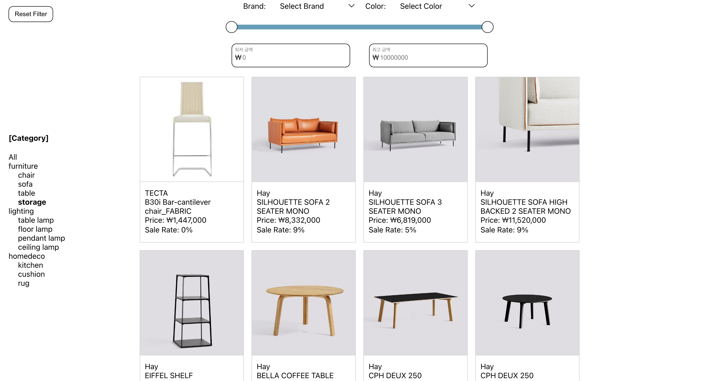

# Product List

## 실행 방법

1. `yarn install` (node_modules 설치)
2. `yarn start` (App 실행)

## 사용 라이브러리

- axios
- react
- typescript
- styled-components

## 구현 내용 및 구현 순서

### 구현 내용

- 브랜드 필터
- 색상 필터
- 가격 필터
- 카테고리 필터
- 상품 목록
- Pagination

### 구현 순서 및 내용

1. 상품 목록

   앱의 구성은 필터링 UI, 상품 목록 표시 UI으로 크게 두 가지로 나누어 볼 수 있었습니다.
   상품 목록 UI가 필터링 기능보다 먼저 구현되면 필터링 동작 작동을 확인하기 용이하다고 생각했기 때문에 상품 목록을 가장 먼저 구현하였습니다.

2. 필터 구현

   최상위 컴포넌트인 App 컴포넌트에서 모든 필터 정보들을 `filter` state로 관리하도록 구현하였습니다. `filter`는 필터 정보들을 담고 있는 객체로 `page`, `color`, `maxPrice`, `minPrice`, `brand`, `categoryId` 값들을 가집니다. `filter` 값이 업데이트되면, http GET 요청에 query parameter로 전달하여 필터링이 적용된 값을 받아와 상품 목록에 적용시키도록 하였습니다.

   필터 구현 순서는 간단한 기능부터 구현하여서 아래와 같은 순서로 구현하였습니다.

   브랜드 필터 > 색상 필터 > 카테고리 필터 > 가격 필터 (완성 X)

#### 미구현 사항

- 가격 필터

  Input을 통한 필터링은 구현하였습니다. Range bar를 통한 가격 필터링은 Bar 형태의 div 2개와 최저, 최고를 조절하는 핸들 2개의 부품을 조합하여 구현하려고 하였습니다.

  - Container: Range Bar Div 입니다.
  - Fill: Left와 Right 사이의 구간을 색칠하는 Div 입니다.
  - Left: 최저 금액을 조절하는 핸들입니다.
  - Right: 최고 금액을 조절하는 핸들입니다.

  Container div를 `position relative`로 설정하고, 내부 부품들을 `position absolute`로 설정하여 내부의 컴포넌트 위치를 조절하는 방법을 생각하였습니다. 금액 구간 값과 내부 부품들의 x축 값(CSS left 이용)이 바인딩 되도록 하는 방식을 계획하였으나 시간이 많이 걸릴 것 같다는 생각이 들었습니다.

- 페이지네이션

  API의 GET products 요청을 통해 상품의 총개수(`total`) 값을 불러올 수 있었습니다.

  페이지 버튼들을 10개씩 가지고 있는 페이지 섹션 배열을 만들어 하나의 페이지 섹션만큼을 페이지 네비게이터에 표시하도록 구상하였습니다. 추가로 페이지 네비게이터 양 끝에 좌우 화살표 버튼을 만들어서 페이지 섹션을 이동할 수 있도록 구현하는 것을 생각해 보았습니다.
